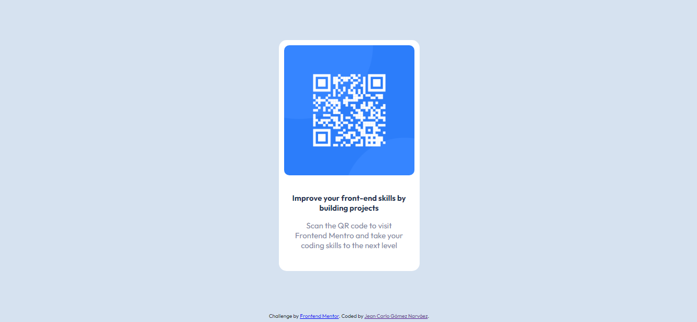

# Frontend Mentor - QR code component solution

This is a solution to the [QR code component challenge on Frontend Mentor](https://www.frontendmentor.io/challenges/qr-code-component-iux_sIO_H). Frontend Mentor challenges help you improve your coding skills by building realistic projects. 

## Table of contents

- [Frontend Mentor - QR code component solution](#frontend-mentor---qr-code-component-solution)
  - [Table of contents](#table-of-contents)
  - [Overview](#overview)
    - [Screenshot](#screenshot)
    - [Links](#links)
  - [My process](#my-process)
    - [Built with](#built-with)
    - [What I learned](#what-i-learned)
    - [Continued development](#continued-development)
    - [Useful resources](#useful-resources)
  - [Author](#author)
  - [Acknowledgments](#acknowledgments)

## Overview

### Screenshot

### Links

- Live Site URL: [https://qr-code-component-main2.netlify.app/]

## My process

### Built with

- Semantic HTML5 markup
- CSS custom properties
- CSS BEM
- Flexbox

### What I learned

---

### Continued development

- Flexbox

### Useful resources

---

## Author

- Frontend Mentor - [@hdlfkja](https://www.frontendmentor.io/profile/hdlfkja)
- Twitter - [@JeanCar27866009](https://twitter.com/JeanCar27866009)

## Acknowledgments

- Juan de la Torre - Curso de desarrolo web completo en Udemy
"# Proyectos"  
# Frontend-mentor
# Frontend-mentor
# Frontend-mentor
